<div align="center">

# CamForge

**凸轮机构运动学模拟器 | Cam Mechanism Kinematics Simulator**

[](https://github.com/EkaEva/CamForge/releases/tag/v0.4.12)
[](LICENSE)
[](https://tauri.app)
[](https://solidjs.com)

[English](#english) | [中文](#中文)


</div>

---

<a name="中文"></a>

## 中文

### 简介

**CamForge** 是一款现代化的凸轮机构运动学模拟器，支持桌面应用和 Web 服务器双模式部署。它能够帮助工程师、学生和研究人员快速设计、分析和优化凸轮机构，支持多种运动规律和实时可视化。

### 结果展示

#### 桌面端界面

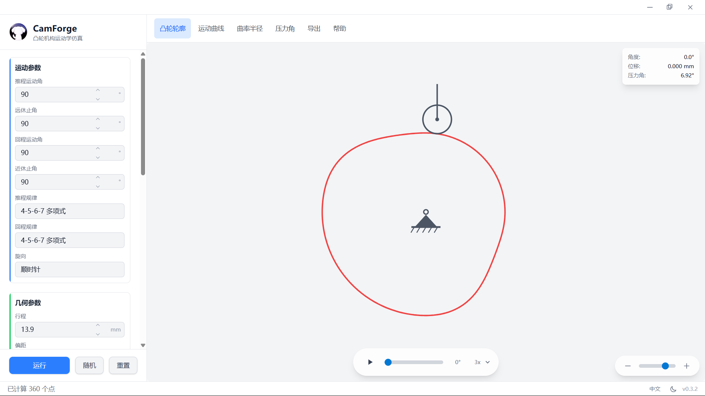

#### 移动端界面

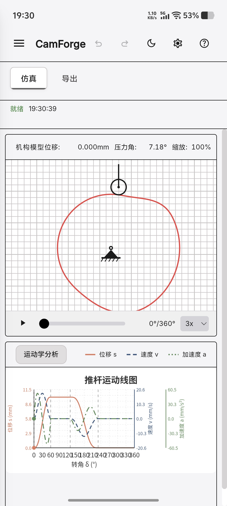

#### 凸轮动画演示


#### 分析图表

| 凸轮轮廓 | 运动曲线 |
|:---:|:---:|
| 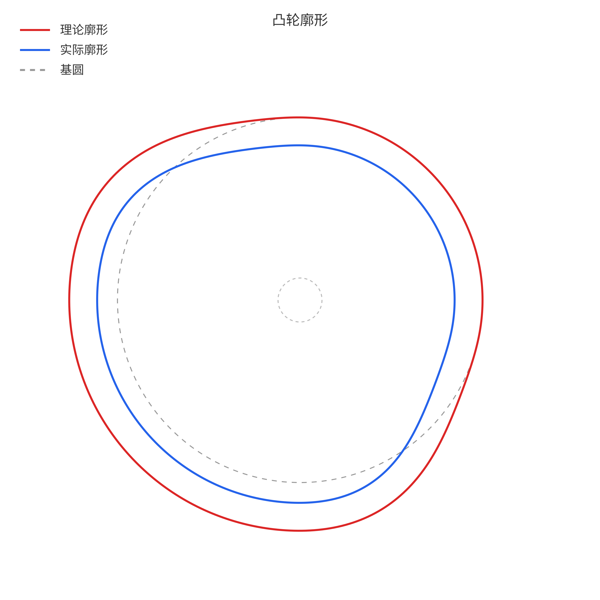 | 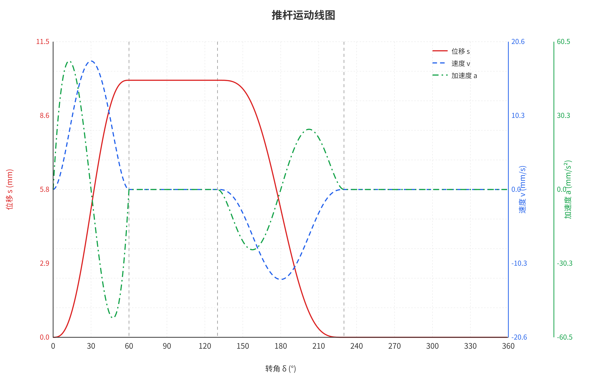 |

| 压力角曲线 | 曲率半径曲线 |
|:---:|:---:|
| 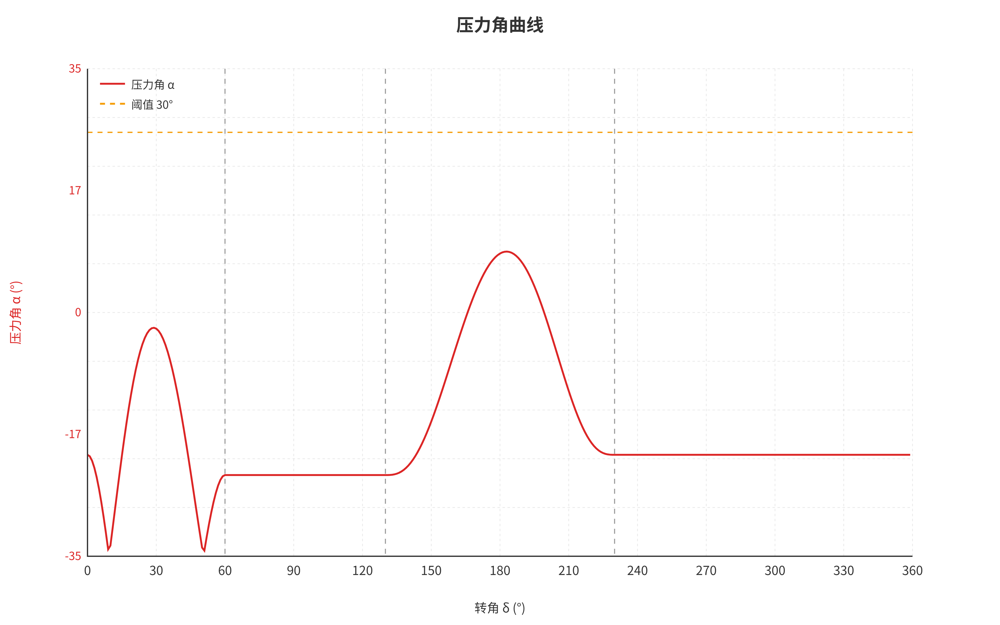 | 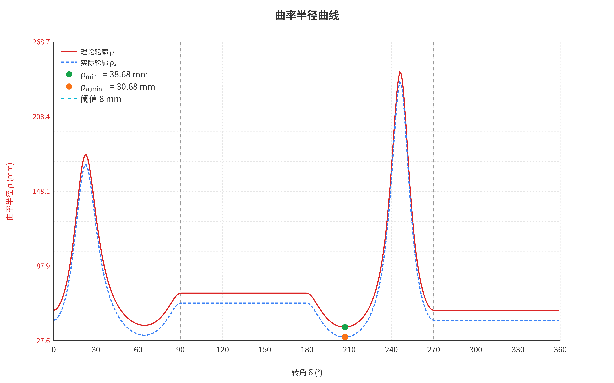 |

### 部署模式

| 模式 | 说明 | 适用场景 |
|------|------|----------|
| **桌面应用** | Tauri + SolidJS，支持所有功能 | 个人使用、离线使用 |
| **Web 服务器** | Axum + SolidJS，支持在线部署 | 团队协作、在线演示 |

### 功能特性

#### 运动规律支持

| 序号 | 运动规律 | 英文名称 | 特点 |
|:---:|:---|:---|:---|
| 1 | 等速运动 | Uniform Motion | 最简单的运动规律，存在刚性冲击 |
| 2 | 等加速等减速 | Constant Acceleration | 存在柔性冲击 |
| 3 | 简谐运动 | Simple Harmonic | 无冲击，适用于中低速 |
| 4 | 摆线运动 | Cycloidal | 无冲击，动力性能好 |
| 5 | 3-4-5 多项式 | 3-4-5 Polynomial | 无冲击，加速度连续 |
| 6 | 4-5-6-7 多项式 | 4-5-6-7 Polynomial | 无冲击，加加速度连续 |

#### 实时可视化

- **凸轮轮廓图**：实时显示理论轮廓与实际轮廓（滚子从动件）
- **运动曲线图**：位移、速度、加速度曲线同步显示
- **压力角曲线**：实时监测压力角是否超限
- **曲率半径曲线**：检测轮廓是否变尖或失真
- **动画演示**：直观展示凸轮机构运动过程

#### 显示选项

- 切线/法线显示
- 压力角弧显示
- 基圆/偏距圆显示
- 上止点/下止点标记
- 节点标记
- 相位边界线

#### 多格式导出

| 格式 | 说明 |
|:---:|:---|
| **DXF** | AutoCAD 兼容的矢量格式，可用于 CNC 加工 |
| **CSV** | 通用数据格式，可用 Excel 打开 |
| **Excel** | 包含完整数据的电子表格 |
| **SVG** | 矢量图形格式，可无损缩放 |
| **PNG** | 高分辨率图片（支持 600 DPI） |
| **TIFF** | 无损图像格式，支持 LZW 压缩与 DPI 元数据 |
| **GIF** | 动画格式，展示凸轮运动过程 |
| **JSON** | 预设配置文件，方便参数保存与分享 |

### 技术栈

| 技术 | 版本 | 用途 |
|:---|:---:|:---|
| [Tauri](https://tauri.app) | v2 | 跨平台桌面应用框架 |
| [SolidJS](https://solidjs.com) | 1.9 | 响应式前端框架 |
| [TypeScript](https://www.typescriptlang.org) | 5.8 | 类型安全的 JavaScript |
| [Tailwind CSS](https://tailwindcss.com) | 4.2 | 原子化 CSS 框架 |
| [Rust](https://www.rust-lang.org) | 1.70+ | 高性能后端计算 |
| [Axum](https://docs.rs/axum) | 0.7 | HTTP API 服务器 |

### 快速开始

#### 环境要求

- **Node.js** 18.0 或更高版本
- **pnpm** 8.0 或更高版本
- **Rust** 1.70 或更高版本
- **Windows 10/11**、**macOS** 或 **Linux**

#### 安装依赖

```bash
# 克隆仓库
git clone https://github.com/EkaEva/CamForge.git
cd camforge

# 安装前端依赖
pnpm install
```

#### 开发模式

```bash
# 桌面应用
pnpm tauri dev

# Web 服务器
pnpm build && cargo run -p camforge-server
```

#### 构建发布

```bash
# 桌面应用
pnpm tauri build

# Web 服务器（Docker）
docker-compose up -d
```

构建产物位于 `src-tauri/target/release/bundle/` 目录下。

### 使用指南

#### 基本参数

| 参数 | 说明 | 单位 |
|:---|:---|:---:|
| 推程运动角 (δ₀) | 推杆上升阶段凸轮转角 | ° |
| 远休止角 (δ₀₁) | 推杆静止在上止点的阶段 | ° |
| 回程运动角 (δᵣ) | 推杆下降阶段凸轮转角 | ° |
| 近休止角 (δ₀₂) | 推杆静止在下止点的阶段 | ° |
| 行程 (h) | 推杆最大位移 | mm |
| 基圆半径 (r₀) | 凸轮最小向径 | mm |
| 偏距 (e) | 推杆导路与凸轮轴心的偏移量 | mm |
| 角速度 (ω) | 凸轮旋转角速度 | rad/s |
| 滚子半径 (rᵣ) | 滚子从动件的滚子半径，0 表示尖底从动件 | mm |
| 压力角阈值 | 许用压力角，超过时显示警告 | ° |

#### 键盘快捷键

| 快捷键 | 功能 |
|:---:|:---|
| `Space` | 播放/暂停动画 |
| `←` | 单帧后退（暂停时） |
| `→` | 单帧前进（暂停时） |
| `Ctrl+Z` | 撤销参数修改 |
| `Ctrl+Y` | 重做参数修改 |

> 注：快捷键仅在凸轮轮廓页面有效

### 项目结构

```
camforge/
├── crates/                    # Rust crates
│   ├── camforge-core/         # 共享核心库
│   │   └── src/
│   │       ├── motion.rs      # 运动规律计算
│   │       ├── full_motion.rs # 全运动周期计算
│   │       ├── profile.rs     # 轮廓计算
│   │       ├── geometry.rs    # 几何分析
│   │       └── types.rs       # 类型定义
│   └── camforge-server/       # HTTP API 服务器
│       └── src/
│           ├── main.rs        # 服务器入口
│           └── routes/        # API 路由
├── src/                       # 前端源码
│   ├── components/            # UI 组件
│   ├── exporters/             # 导出模块（DXF/CSV/Excel/TIFF）
│   ├── hooks/                 # 自定义 Hooks
│   ├── stores/                # 状态管理
│   ├── constants/             # 常量定义
│   ├── types/                 # 类型声明
│   ├── api/                   # API 适配层
│   ├── i18n/                  # 国际化
│   └── utils/                 # 工具函数
├── src-tauri/                 # Tauri 桌面应用
│   └── src/
│       ├── lib.rs             # 应用入口
│       └── commands/          # Tauri 命令
├── docs/                      # 文档
├── Dockerfile                 # Docker 部署
├── docker-compose.yml         # Docker Compose
└── Cargo.toml                 # Workspace 配置
```

### 开发路线

- [x] 6 种运动规律（等速、等加速、简谐、摆线、3-4-5、4-5-6-7 多项式）
- [x] 凸轮轮廓绘制与动画演示
- [x] 压力角 / 曲率半径实时分析
- [x] 多格式导出（DXF、CSV、Excel、SVG、PNG、TIFF、GIF、JSON）
- [x] 中英文国际化
- [x] 撤销 / 重做
- [x] 桌面端 + Web 服务器双模式部署（Tauri / Axum / Docker）
- [x] 跨平台支持（Windows / macOS / Linux / iOS / Android）
- [x] 移动端响应式布局与触摸手势
- [x] Material Design 3 设计系统
- [x] 安全加固（CSP nonce、速率限制、HSTS、Docker 非 root）
- [x] 5 种从动件类型（直动尖底、直动滚子、直动平底、摆动滚子、摆动平底）
- [ ] 凸轮机构优化算法

### 许可证

本项目基于 [MIT License](LICENSE) 开源。

---

<a name="english"></a>

## English

### Overview

**CamForge** is a modern cam mechanism kinematics simulator that supports both desktop application and web server deployment. It helps engineers, students, and researchers quickly design, analyze, and optimize cam mechanisms with support for various motion laws and real-time visualization.

### Showcase

#### Desktop Interface

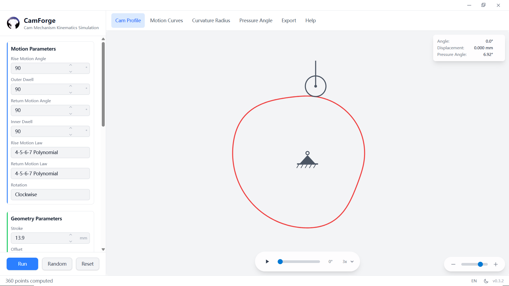

#### Mobile Interface

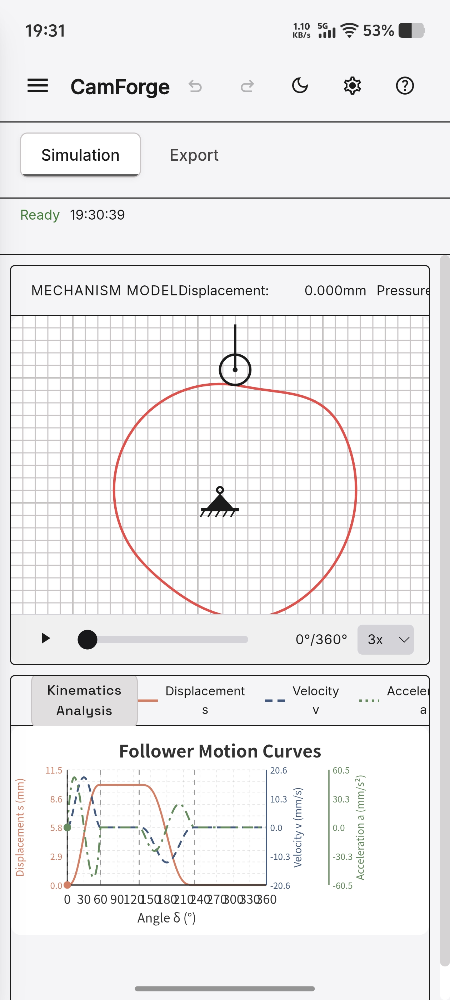

#### Cam Animation Demo


#### Analysis Charts

| Cam Profile | Motion Curves |
|:---:|:---:|
| 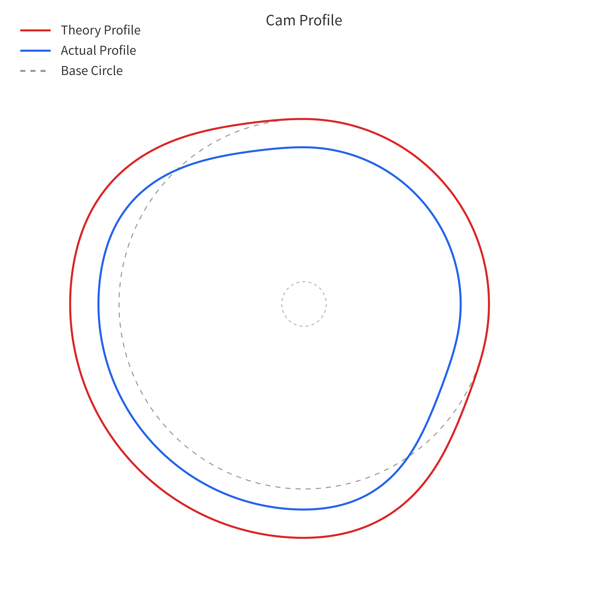 | 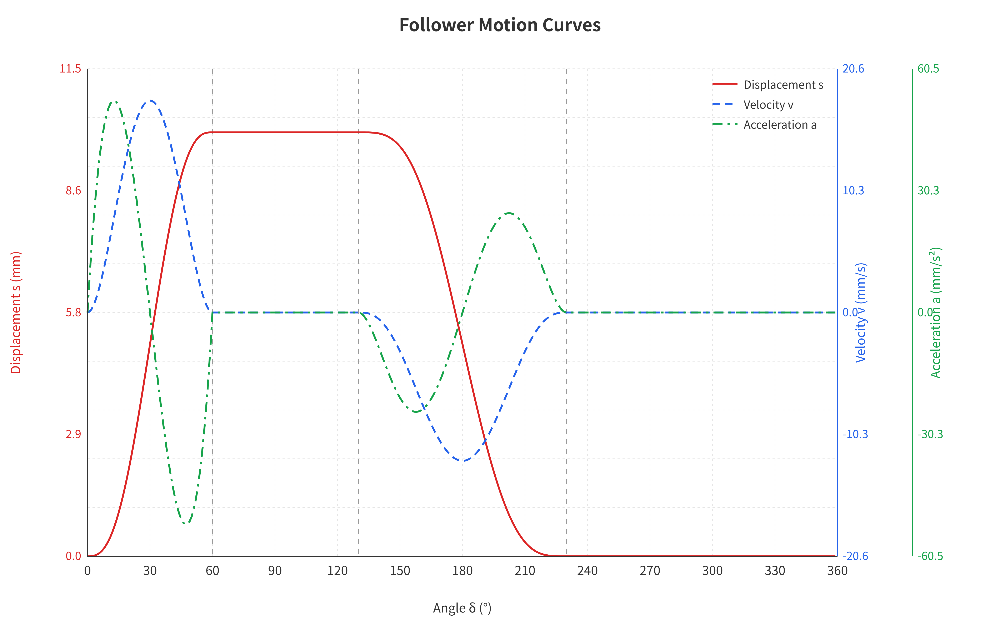 |

| Pressure Angle | Curvature Radius |
|:---:|:---:|
| 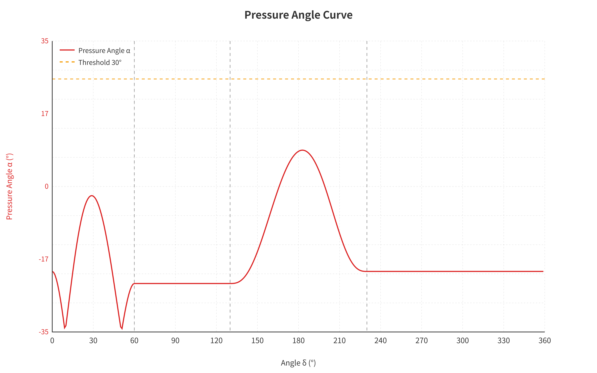 | 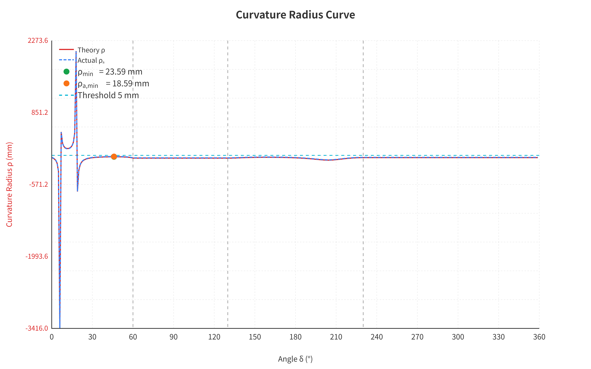 |

### Deployment Modes

| Mode | Description | Use Case |
|------|-------------|----------|
| **Desktop App** | Tauri + SolidJS with full functionality | Personal use, offline use |
| **Web Server** | Axum + SolidJS for online deployment | Team collaboration, online demo |

### Features

#### Motion Laws

| No. | Motion Law | Characteristics |
|:---:|:---|:---|
| 1 | Uniform Motion | Simplest motion law, has rigid impact |
| 2 | Constant Acceleration | Has flexible impact |
| 3 | Simple Harmonic | No impact, suitable for medium-low speed |
| 4 | Cycloidal | No impact, good dynamic performance |
| 5 | 3-4-5 Polynomial | No impact, continuous acceleration |
| 6 | 4-5-6-7 Polynomial | No impact, continuous jerk |

#### Real-time Visualization

- **Cam Profile**: Real-time display of theoretical and actual profiles (roller follower)
- **Motion Curves**: Synchronous display of displacement, velocity, and acceleration
- **Pressure Angle Curve**: Real-time monitoring of pressure angle limits
- **Curvature Radius Curve**: Detection of profile cusps or undercutting
- **Animation**: Intuitive demonstration of cam mechanism motion

#### Display Options

- Tangent/Normal lines
- Pressure angle arc
- Base circle/Offset circle
- Upper/Lower limit marks
- Node markers
- Phase boundary lines

#### Multi-format Export

| Format | Description |
|:---:|:---|
| **DXF** | AutoCAD-compatible vector format for CNC machining |
| **CSV** | Universal data format, can be opened with Excel |
| **Excel** | Spreadsheet with complete data |
| **SVG** | Vector graphics format, scalable without quality loss |
| **PNG** | High-resolution image (supports 600 DPI) |
| **TIFF** | Lossless image format with LZW compression and DPI metadata |
| **GIF** | Animation format showing cam motion |
| **JSON** | Preset configuration file for parameter saving and sharing |

### Tech Stack

| Technology | Version | Purpose |
|:---|:---:|:---|
| [Tauri](https://tauri.app) | v2 | Cross-platform desktop framework |
| [SolidJS](https://solidjs.com) | 1.9 | Reactive frontend framework |
| [TypeScript](https://www.typescriptlang.org) | 5.8 | Type-safe JavaScript |
| [Tailwind CSS](https://tailwindcss.com) | 4.2 | Utility-first CSS framework |
| [Rust](https://www.rust-lang.org) | 1.70+ | High-performance backend computation |
| [Axum](https://docs.rs/axum) | 0.7 | HTTP API server |

### Quick Start

#### Prerequisites

- **Node.js** 18.0 or higher
- **pnpm** 8.0 or higher
- **Rust** 1.70 or higher
- **Windows 10/11**, **macOS**, or **Linux**

#### Installation

```bash
# Clone the repository
git clone https://github.com/EkaEva/CamForge.git
cd camforge

# Install frontend dependencies
pnpm install
```

#### Development Mode

```bash
# Desktop app
pnpm tauri dev

# Web server
pnpm build && cargo run -p camforge-server
```

#### Build for Production

```bash
# Desktop app
pnpm tauri build

# Web server (Docker)
docker-compose up -d
```

Build artifacts are located in `src-tauri/target/release/bundle/`.

### Usage Guide

#### Basic Parameters

| Parameter | Description | Unit |
|:---|:---|:---:|
| Rise Motion Angle (δ₀) | Cam rotation angle during rise phase | ° |
| Outer Dwell (δ₀₁) | Dwell at maximum displacement | ° |
| Return Motion Angle (δᵣ) | Cam rotation angle during return phase | ° |
| Inner Dwell (δ₀₂) | Dwell at minimum displacement | ° |
| Stroke (h) | Maximum follower displacement | mm |
| Base Radius (r₀) | Minimum cam radius | mm |
| Offset (e) | Distance between follower axis and cam center | mm |
| Angular Velocity (ω) | Cam rotation speed | rad/s |
| Roller Radius (rᵣ) | Roller radius (0 for knife-edge follower) | mm |
| Pressure Angle Limit | Maximum allowable pressure angle | ° |

#### Keyboard Shortcuts

| Shortcut | Function |
|:---:|:---|
| `Space` | Play/Pause animation |
| `←` | Step backward (when paused) |
| `→` | Step forward (when paused) |
| `Ctrl+Z` | Undo parameter change |
| `Ctrl+Y` | Redo parameter change |

> Note: Shortcuts only work on the Cam Profile page

### Project Structure

```
camforge/
├── crates/                    # Rust crates
│   ├── camforge-core/         # Shared core library
│   │   └── src/
│   │       ├── motion.rs      # Motion law calculation
│   │       ├── full_motion.rs # Full motion cycle calculation
│   │       ├── profile.rs     # Profile calculation
│   │       ├── geometry.rs    # Geometry analysis
│   │       └── types.rs       # Type definitions
│   └── camforge-server/       # HTTP API server
│       └── src/
│           ├── main.rs        # Server entry
│           └── routes/        # API routes
├── src/                       # Frontend source code
│   ├── components/            # UI components
│   ├── exporters/             # Export modules (DXF/CSV/Excel/TIFF)
│   ├── hooks/                 # Custom hooks
│   ├── stores/                # State management
│   ├── constants/             # Constants
│   ├── types/                 # Type declarations
│   ├── api/                   # API adapter layer
│   ├── i18n/                  # Internationalization
│   └── utils/                 # Utility functions
├── src-tauri/                 # Tauri desktop app
│   └── src/
│       ├── lib.rs             # App entry
│       └── commands/          # Tauri commands
├── docs/                      # Documentation
├── Dockerfile                 # Docker deployment
├── docker-compose.yml         # Docker Compose
└── Cargo.toml                 # Workspace config
```

### Roadmap

- [x] 6 motion laws (Uniform, Constant Acceleration, Simple Harmonic, Cycloidal, 3-4-5 Polynomial, 4-5-6-7 Polynomial)
- [x] Cam profile drawing & animation
- [x] Pressure angle / curvature radius real-time analysis
- [x] Multi-format export (DXF, CSV, Excel, SVG, PNG, TIFF, GIF, JSON)
- [x] Chinese/English internationalization
- [x] Undo / Redo
- [x] Desktop + Web server dual-mode deployment (Tauri / Axum / Docker)
- [x] Cross-platform support (Windows / macOS / Linux / iOS / Android)
- [x] Mobile responsive layout & touch gestures
- [x] Material Design 3 design system
- [x] Security hardening (CSP nonce, rate limiting, HSTS, Docker non-root)
- [x] 5 follower types (translating knife-edge, translating roller, translating flat-faced, oscillating roller, oscillating flat-faced)
- [ ] Cam mechanism optimization algorithm

### License

This project is open-sourced under the [MIT License](LICENSE).

---

<div align="center">

**Made with ❤️ by CamForge Team**

</div>